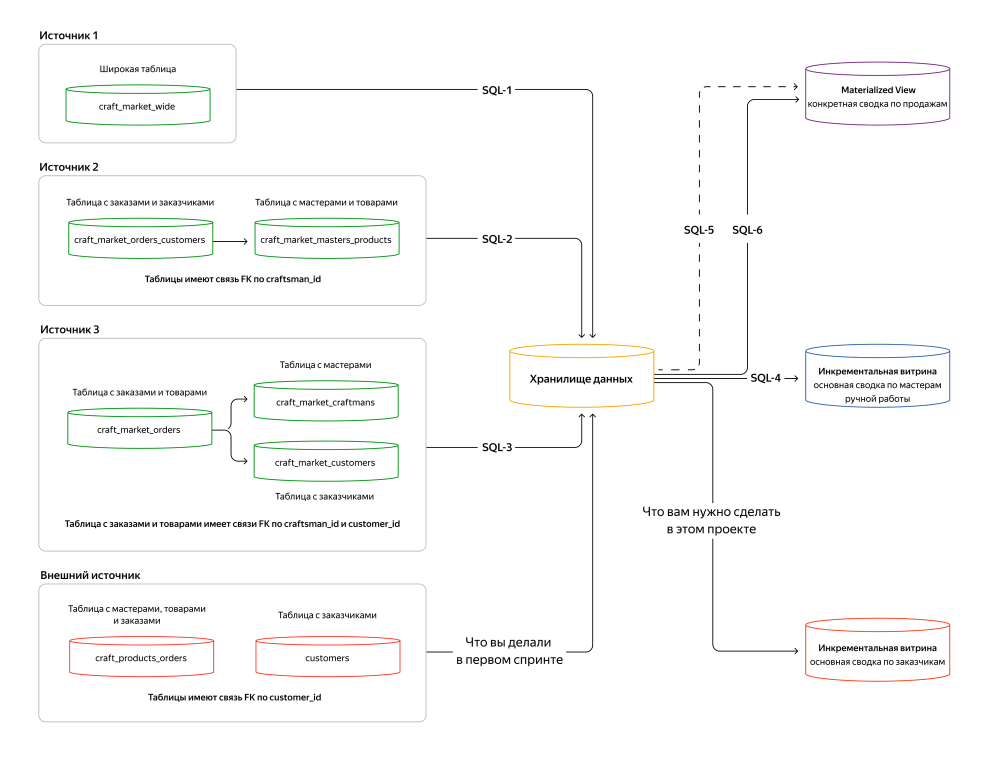

# de-project-sprint-2-2023

## Задание

### Описание

В этом проекте добавляется новый источник в DWH для проверки навыков интеграции.

Маркетплейс товаров ручной работы набирает популярность и расширяет свою аудиторию. Чтобы привлечь больше покупателей, приобрели ещё один сайт, который предоставляет похожие услуги. Формальная часть сделки завершена, нужно интегрировать данные купленного сайта в хранилище.

Добавление нового источника — тот же процесс, что и загрузка предыдущих источников: нужно интегрировать данные и построить новую витрину.
В данном случае нужно построить инкрементальную витрину с отчётом по заказчикам. Она пригодится, чтобы внедрить программу лояльности, изучить интересы пользователей, сделать более релевантной систему рекомендаций товаров и скорректировать маркетинговый план по акциям.

### Общая схема проекта

## Выполнение

### 1. Подключение к базе данных

В рамках задания подключился к БД `playground_sp1_20240203_8f1bbf0156`

Модель данных:

- `dwh` — таблицы измерений:
  - `d_craftsman`: мастера ручной работы
  - `d_customer`: заказчики
  - `d_product`: товары
  - `f_order`: факты о продажах
  - `craftsman_report_datamart`: инкрементальная витрина по мастерам за отчётные периоды
  - `orders_report_materialized_view`: MATERIALIZED VIEW с отчётом продаж по всему маркетплейсу
- `source1` — широкая таблица первого источника `craft_market_wide`.
- `source2` — две ненормализованные таблицы:
  - `craft_market_masters_products`: таблица мастеров и товаров
  - `craft_market_orders_customers`: таблица заказчиков и заказов
- `source3` — три таблицы:
  - `craft_market_craftsmans`: мастера
  - `craft_market_customers`: заказчики
  - `craft_market_orders`: заказы с товарами
- `external_source`: новая схема. В ней находятся таблицы нового источника, которые нужно подключить к хранилищу:
  - `craft_products_orders`: данные по мастерам, товарам и заказам
  - `customers`: данные только по заказчикам

### 2. Изучение данных

- Для изучения структуры данных БД подготовлены запросы в файле [0_analysis.sql](0_analysis.sql)

#### dwh.d_craftsman

| column_name | data_type |
|---|---|
| craftsman_id | bigint |
| craftsman_name | character varying |
| craftsman_address | character varying |
| craftsman_birthday | date |
| craftsman_email | character varying |
| load_dttm | timestamp without time zone |

#### dwh.d_product

| column_name | data_type |
|---|---|
| product_id | bigint |
| product_name | character varying |
| product_description | character varying |
| product_type | character varying |
| product_price | bigint |
| load_dttm | timestamp without time zone |

#### dwh.d_customer

| column_name | data_type |
|---|---|
| customer_name | character varying |
| customer_id | bigint |
| customer_birthday | date |
| load_dttm | timestamp without time zone |
| customer_address | character varying |
| customer_email | character varying |

#### dwh.f_order

| column_name | data_type |
|---|---|
| craftsman_id | bigint |
| product_id | bigint |
| order_id | bigint |
| customer_id | bigint |
| order_created_date | date |
| order_status | character varying |
| load_dttm | timestamp without time zone |
| order_completion_date | date |

#### external_source.craft_products_orders

| column_name | data_type |
| - | - |
| id | bigint |
| craftsman_id | bigint |
| craftsman_name | character varying |
| craftsman_address | character varying |
| craftsman_birthday | date |
| craftsman_email | character varying |
| product_id | bigint |
| product_name | character varying |
| product_description | character varying |
| product_type | character varying |
| product_price | bigint |
| order_id | bigint |
| order_created_date | date |
| order_completion_date | date |
| order_status | character varying |
| customer_id | bigint |

#### external_source.customers

| column_name | data_type |
| - | - |
| customer_id | bigint |
| customer_name | character varying |
| customer_address | character varying |
| customer_birthday | date |
| customer_email | character varying |

### 3. Перенос данных из источника в хранилище

Скрипт загрузки данных из нового источника в файле [1_load_new_source.sql](1_load_new_source.sql)
Данные из источника нужно постоянно забирать и собирать в хранилище.
Данные должны попасть в схему dwh по тому же принципу, что и из схем source1, source2, source3.

### 4. Изучите потребности бизнеса в новой витрине

Изучите постановку задачи от бизнес-аналитика и исследуйте хранилище на соответствие данных. Посмотрите, какие данные понадобятся для создания DDL новой витрины.
Бизнесу требуются следующие данные:

- идентификатор записи;
- идентификатор заказчика;
- Ф. И. О. заказчика;
- адрес заказчика;
- дата рождения заказчика;
- электронная почта заказчика;
- сумма, которую потратил заказчик;
- сумма, которую заработала платформа от покупок заказчика за месяц (10% от суммы, которую потратил заказчик);
- количество заказов у заказчика за месяц;
- средняя стоимость одного заказа у заказчика за месяц;
- медианное время в днях от момента создания заказа до его завершения за месяц;
- самая популярная категория товаров у этого заказчика за месяц;
- идентификатор самого популярного мастера ручной работы у заказчика. Если заказчик сделал одинаковое количество заказов - у нескольких мастеров, возьмите любого;
- количество созданных заказов за месяц;
- количество заказов в процессе изготовки за месяц;
- количество заказов в доставке за месяц;
- количество завершённых заказов за месяц;
- количество незавершённых заказов за месяц;
- отчётный период, год и месяц.

### 5. Создание новой витрины

Скрипт DDL для новой витрины `dwh.customer_report_datamart` в файле [2_ddl.sql](2_ddl.sql)
DDL определяет типы, названия полей и комментарии.
Для реализации инкрементальной витрины  подготовлена дополнительная таблица с датой загрузки данных.

### 6. Инкрементальное обновление витрины

Скрипт для инкрементального обновления витрины в файле [3_incremental_update.sql](3_incremental_update.sql)
Скрипт выполняет инкрементальный расчёт для новой витрины.
Определены идентификаторы самого популярного мастера у заказчика и самой популярной категории товаров.
